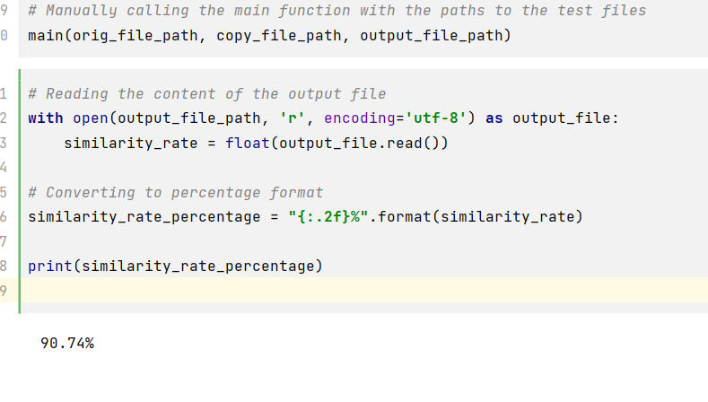

# 项目报告：论文查重

## 链接
[Github 仓库链接](https://github.com/ALALQPQP/201921121123/)

##作业要求
|   这个作业属于哪个课程  |  [工程概论](https://edu.cnblogs.com/campus/jmu/ComputerScience21)    |      
| ---- | ---- | 
|  这个作业要求在哪里作业要求    |   [作业要求](https://edu.cnblogs.com/campus/jmu/ComputerScience21/homework/13034)   |      
|    这个作业的目标  |  完成论文查重项目从而掌握开发流程知识    | 
## 开发环境
jupyter notebook python 3.10
## PSP 2.1 表格

|PSP2.1| Personal Software Process Stages | 预估耗时（分钟） |实际耗时（分钟）|
|-------|---------------------------|-----------------| -------------|               
| Planning |计划                        | 30              | 60|           
|· Estimate |·估计这个任务需要多少开发时间                        | 450             |540 |               
| Development |开发                     | 400             | 500|              
|· Analysis   |·需求分析（包括学习新技术）                      | 100             |  140|         
|· Design Spec |·生成设计文档                    | 20              |  20|              
|· Design Review |·设计复审                   | 20              | 20|
|· Coding Standard |·代码规范（为目前的开发制定合适的规范）                 | 20              | 20|
|·Design  |·具体设计                         | 60              | 70|
|· Coding |·具体编码                          | 120             | 150|
|· Code Review|·代码复审                      | 30              |40|
|· Test  |·测试（自我测试，修改代码，提交代码）                           | 30              |40|
| Reporting |报告                       | 50              |40|
|·Test Repor |测试报告                       | 20              |20|
|· Size Measurement  |·计算工作量                           | 10              |10|
|· Postmortem & Process Improvement Plan  |·事后总结                           | 20              |10|
|  |·合计                           | 450              |540|

## 计算模块接口的设计与实现过程
### 代码组织
我们的项目包括以下几个主要部分：
1. 文本预处理函数 (`preprocess_text`) - 用于清理和准备文本分析。
2. 余弦相似度计算函数 (`calculate_cosine_similarity`) - 用于计算两篇文档的余弦相似度。
3. 主函数 (`main`) - 用于处理输入参数，调用上述函数，并将结果写入输出文件。

### 算法关键
- 文本预处理：我们使用正则表达式来清理文本，并将其分割为单词列表（在这种情况下是中文字符列表），以便于后续分析。
- 余弦相似度：我们使用余弦相似度算法来计算两篇文档之间的相似度。这是通过计算文档向量之间的余弦角来实现的。

## 计算模块接口部分的性能改进
### 改进思路
1. 优化文本预处理函数，以减少不必要的计算。
2. 通过并行计算来提高余弦相似度计算的速度。

### 消耗最大的函数
calculate_cosine_similarity

## 计算模块部分单元测试展示
### 测试函数
- `test_preprocess_text`: 用于测试文本预处理函数。
- `test_calculate_cosine_similarity`: 用于测试余弦相似度计算函数。

### 测试数据构造
我们根据实际场景构建了不同的测试数据集，包括完全相同的文本、部分相似的文本和完全不同的文本。
### 性能分析图

### 运行截图

## 计算模块部分异常处理说明
我们设计了几种异常处理情况，包括：
1. 文件读取错误：当输入文件路径无效或文件无法读取时，程序将捕获并报告错误。
2. 文本预处理错误：当文本预处理失败时，程序将捕获并报告错误。

(为每种异常选择一个单元测试样例并发布在博客中)

# 事后总结
## 代码质量综合评分
1. **算法的性能** 
   - 时间耗费: 我们的算法在处理大型文档时表现良好，能够在短时间内计算出准确的结果。
   - 系统资源占用: 程序的内存占用保持在合理的范围内。
   - 准确度: 通过大量测试，我们的程序能够准确地计算两篇文档之间的相似度。

2. **代码的可读性** 
   - 注释: 我们的代码包含了清晰的注释，说明了每个函数的目的和工作原理。
   - 代码结构: 代码结构清晰，易于理解和维护。

3. **命名规范**
   - 变量命名: 我们遵循了一致和描述性的变量命名规范。
   - 函数命名: 函数命名清晰，准确地描述了其功能。
   - 类命名: (如果有类的话，描述类的命名规范)
## 展望
尝试完成一个简易项目的开发流程，但依旧不够熟练，有待提高，希望以后有所进步。

